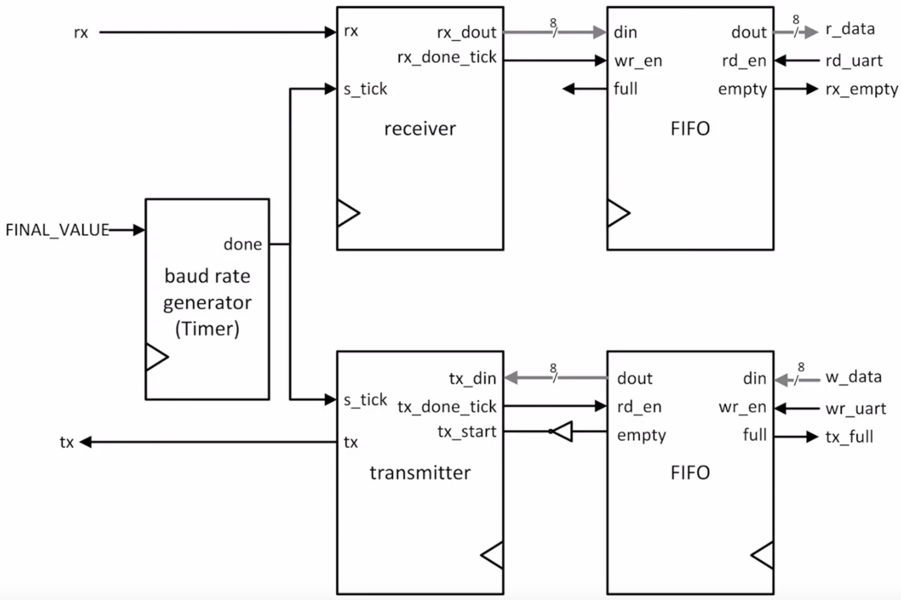
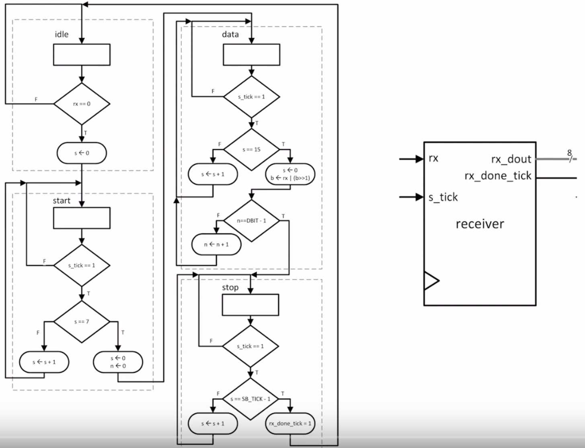

# Bringup: What language is hardware coded in? 

- Blinkin an LED (Verilog, 10)

- Building a UART (Verilog, 100)

## resources

### led
-

### uart

- [Understanding Uart Video](https://www.youtube.com/watch?v=sTHckUyxwp8&ab_channel=RohdeSchwarz)

- https://www.analog.com/en/analog-dialogue/articles/uart-a-hardware-communication-protocol.html

- [VerilogQuickRef.pdf](uart/resources/VerilogQuickRef.pdf)

- 

- 
  2 

